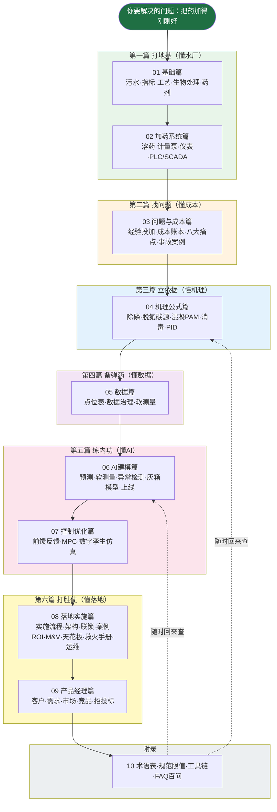

# AI 辅助污水厂加药管控：从小白到落地实战专家

> 一套**系统、实际、能落地**的完整教程：从"污水厂是干什么的、药剂都加在哪"讲起，一直讲到"怎么用机理公式、机器学习和 AI 把药耗降下来、把项目做成、把钱赚回来"。
>
> 不讲空洞理论。每一个公式都有**符号解释 + 单位 + 经验取值 + 完整算例**；每一个方案都有**真实场景、真实数字、真实的坑**。

---

## 一、这套教程写给谁看

| 你是谁 | 你能从这里带走什么 |
|---|---|
| 刚入行的污水厂运行工 / 工艺员 / 应届毕业生 | 看懂全厂工艺、药剂、仪表、控制系统，知道"老师傅为什么这么投药" |
| 自控 / 仪表工程师 | 知道污水厂数据长什么样、加药回路怎么搭、AI 闭环怎么安全地接上 PLC |
| 算法 / 数据工程师 | 拿到可运行的建模代码、数据字典、软测量与异常检测套路、上线避坑清单 |
| 环保公司 / 设计院 / 集成商 | 知道 AI 加药项目怎么调研、怎么报价、怎么做 POC、怎么验收、怎么算节药率 |
| 产品经理 / 销售 / 创业者 | 客户画像、需求痛点、价值量化、ROI 模型、市场规模、招投标与商务模式 |
| 污水厂厂长 / 水务集团管理者 | 看懂 AI 能干什么不能干什么、要花多少钱、省多少钱、风险怎么控 |

**零基础假设**：你不需要提前会污水处理，也不需要提前会机器学习。第一章从"污水是什么、为什么要处理"讲起；机器学习从"什么是特征、什么是模型"讲起。你只需要初中化学和初中数学水平，跟着算例走即可。

---

## 二、教程全景图



**阅读心法一句话**：工艺是身体，药剂是饭菜，仪表是眼睛，数据是血液，机理是骨架，AI 是大脑，控制是手脚，安全是底线，效益是理由。

---

## 三、完整目录（共 52 章）

### 00 导读（先看这里）

| 章节 | 内容 |
|---|---|
| [00-0 写给小白的话：你将学会什么](./00-导读/00-0-写给小白的话-你将学会什么.md) | 学习目标、能力地图、本教程的使用方法 |
| [00-1 教程地图与四条学习路径](./00-导读/00-1-教程地图与四条学习路径.md) | 小白/工程师/算法/产品经理 四条路线 |
| [00-2 五分钟看懂污水厂 AI 加药](./00-导读/00-2-五分钟看懂污水厂AI加药.md) | 一个故事讲完全书主线 |

### 01 基础篇：先看懂污水厂

| 章节 | 内容 |
|---|---|
| [01-1 污水从哪来、到哪去：一座污水厂的一天](./01-基础篇/01-1-污水从哪来到哪去-一座污水厂的一天.md) | 污水来源、排放标准、全厂水线一镜到底 |
| [01-2 污水的体检报告：核心指标通俗讲义](./01-基础篇/01-2-污水的体检报告-核心指标通俗讲义.md) | COD/BOD/氨氮/总氮/总磷/SS/pH/碱度逐个讲透 |
| [01-3 污水处理工艺全流程图解](./01-基础篇/01-3-污水处理工艺全流程图解.md) | 预处理→一级→生物→二沉→深度→污泥全工艺 |
| [01-4 生物处理：微生物"打工仔"的食堂与宿舍](./01-基础篇/01-4-生物处理-微生物打工仔的食堂与宿舍.md) | 活性污泥、AAO、氧化沟、SBR、MBR 对比 |
| [01-5 加药点全景：全厂药剂家族图谱](./01-基础篇/01-5-加药点全景-全厂药剂家族图谱.md) | 除磷剂/碳源/PAM/消毒剂/脱水剂 在哪加、干什么 |

### 02 加药系统篇：药是怎么加到水里的

| 章节 | 内容 |
|---|---|
| [02-1 加药系统硬件全景：从药袋到出水口](./02-加药系统篇/02-1-加药系统硬件全景-从药袋到出水口.md) | 储罐、溶配、计量投加、混合反应全链条 |
| [02-2 计量泵、管路与溶配药系统](./02-加药系统篇/02-2-计量泵管路与溶配药系统.md) | 计量泵选型、材质、稀释、防结晶、故障处理 |
| [02-3 在线仪表：污水厂的"传感器眼睛"](./02-加药系统篇/02-3-在线仪表-污水厂的传感器眼睛.md) | COD/氨氮/总磷/DO/ORP/流量仪表原理与维护 |
| [02-4 PLC 与 SCADA：数据怎么采、控制怎么做](./02-加药系统篇/02-4-PLC与SCADA-数据怎么采控制怎么做.md) | PLC 接线、4-20mA、组态、手自动切换 |

### 03 问题与成本篇：为什么要花钱上 AI

| 章节 | 内容 |
|---|---|
| [03-1 传统加药怎么投：老师傅经验操作全揭秘](./03-问题与成本篇/03-1-传统加药怎么投-老师傅经验操作全揭秘.md) | 定时定量、看天吃饭、经验公式的真实样子 |
| [03-2 污水厂成本账本：药剂到底花了多少钱](./03-问题与成本篇/03-2-污水厂成本账本-药剂到底花了多少钱.md) | 吨水成本拆解、药耗基准、各厂真实区间 |
| [03-3 加药管控八大痛点](./03-问题与成本篇/03-3-加药管控八大痛点.md) | 滞后、过量、波动、污泥增量、超标罚款全梳理 |
| [03-4 真实事故与返工案例集](./03-问题与成本篇/03-4-真实事故与返工案例集.md) | 总磷超标、碳源崩池、PAM 堵管等真实故事 |

### 04 机理公式篇：算得清，才省得下

| 章节 | 内容 |
|---|---|
| [04-1 化学除磷机理与投加量计算](./04-机理公式篇/04-1-化学除磷机理与投加量计算.md) | 溶度积、投加系数 β、铝盐铁盐计算例题 |
| [04-2 生物脱氮除磷机理与碳源投加计算](./04-机理公式篇/04-2-生物脱氮除磷机理与碳源投加计算.md) | 硝化反硝化、C/N、碳源 COD 当量、补碳算例 |
| [04-3 混凝动力学与 PAM 助凝](./04-机理公式篇/04-3-混凝动力学与PAM助凝.md) | 双电层、架桥、G/GT 值、PAM 选型与熟化 |
| [04-4 消毒、pH 中和与其他药剂计算](./04-机理公式篇/04-4-消毒pH中和与其他药剂计算.md) | 有效氯、CT 值、酸碱中和、污泥石灰 |
| [04-5 加药过程动态特性：PID、前馈与反馈](./04-机理公式篇/04-5-加药过程动态特性-PID前馈与反馈.md) | 滞后时间常数、PID 整定、前馈+反馈结构 |

### 05 数据篇：AI 的粮食

| 章节 | 内容 |
|---|---|
| [05-1 数据从哪来：点位表与数据字典](./05-数据篇/05-1-数据从哪来-点位表与数据字典.md) | SCADA/LIMS/化验数据、典型 200 点位清单 |
| [05-2 数据质量治理：脏数据的"九种死法"](./05-数据篇/05-2-数据质量治理-脏数据的九种死法.md) | 缺失、卡死、漂移、冲洗干扰、标定处理 |
| [05-3 软测量：用便宜仪表"猜"贵指标](./05-数据篇/05-3-软测量-用便宜仪表猜贵指标.md) | 软测量原理、输入变量选择、可信度评估 |

### 06 AI 建模篇：大脑是怎么炼成的

| 章节 | 内容 |
|---|---|
| [06-1 AI 加药能力地图：什么活能交给 AI](./06-AI建模篇/06-1-AI加药能力地图-什么活能交给AI.md) | 预测/前馈/优化/诊断/视觉五类能力边界 |
| [06-2 机器学习速成（污水厂版）](./06-AI建模篇/06-2-机器学习速成-污水厂版.md) | 特征、训练、过拟合、树模型与神经网络 |
| [06-3 加药量预测建模完整实战](./06-AI建模篇/06-3-加药量预测建模完整实战.md) | 合成数据+随机森林/XGBoost 全流程代码 |
| [06-4 出水指标预测与软测量建模](./06-AI建模篇/06-4-出水指标预测与软测量建模.md) | 预测总磷/氨氮、时序特征、标签对齐 |
| [06-5 异常检测与工况识别](./06-AI建模篇/06-5-异常检测与工况识别.md) | 仪表故障识别、冲击负荷预警、无监督方法 |
| [06-6 机理加数据：灰箱混合模型最落地](./06-AI建模篇/06-6-机理加数据-灰箱混合模型最落地.md) | 机理打底+数据修正，为什么这是首选路线 |
| [06-7 模型上线、监控与迭代运维](./06-AI建模篇/06-7-模型上线监控与迭代运维.md) | 漂移监控、再训练、影子运行、效果台账 |

### 07 控制优化篇：让 AI 真正动手加药

| 章节 | 内容 |
|---|---|
| [07-1 从开环建议到闭环控制：三种架构](./07-控制优化篇/07-1-从开环建议到闭环控制-三种架构.md) | 人工执行/半自动设定值/全自动闭环对比 |
| [07-2 前馈加反馈控制器设计实例](./07-控制优化篇/07-2-前馈加反馈控制器设计实例.md) | 除磷加药回路完整推导与仿真 |
| [07-3 MPC 模型预测控制怎么落地](./07-控制优化篇/07-3-MPC模型预测控制怎么落地.md) | MPC 原理、约束、优化求解、适用场景 |
| [07-4 数字孪生与仿真验证：BSM 基准平台](./07-控制优化篇/07-4-数字孪生与仿真验证-BSM基准平台.md) | BSM1/ASM 仿真、上线前先在孪生世界试跑 |

### 08 落地实施篇：项目是怎么做成的

| 章节 | 内容 |
|---|---|
| [08-1 项目实施全流程：从调研到验收](./08-落地实施篇/08-1-项目实施全流程-从调研到验收.md) | 八阶段实施法、里程碑、交付物清单 |
| [08-2 系统架构与边缘部署](./08-落地实施篇/08-2-系统架构与边缘部署.md) | 网关、时序库、模型服务、网闸与信息安全 |
| [08-3 安全、联锁与人工接管](./08-落地实施篇/08-3-安全联锁与人工接管.md) | 限幅、速率限制、联锁条件、四级权限 |
| [08-4 三个典型厂案例：方案、BOM 与 ROI](./08-落地实施篇/08-4-三个典型厂案例-方案BOM与ROI.md) | 2 万吨 CASS / 10 万吨 AAO / 20 万吨 MBR |
| [08-5 节能率怎么算：效益测量与验证 M&V](./08-落地实施篇/08-5-节能率怎么算-效益测量与验证MV.md) | IPMVP 思路、基线修正、节药率对赌 |
| [08-6 行业十道天花板：做不到的事与现实的凑合方案](./08-落地实施篇/08-6-行业十道天花板-做不到的事与现实的凑合方案.md) | 进水不可观测、标签稀疏、大滞后等十大公认边界与凑合层级 |
| [08-7 现场救火手册：四十个高频故障的临时处置](./08-落地实施篇/08-7-现场救火手册-四十个高频故障的临时处置.md) | 泵阀/仪表/网络/执行/药剂/应急 40 条：现象→先这么救→根治 |
| [08-8 上线之后：运维制度与组织保障怎么建](./08-落地实施篇/08-8-上线之后-运维制度与组织保障怎么建.md) | 四个主人、预防维护、费用边界、SLA、模型移交、考核责任 |

### 09 产品经理篇：把技术变成生意

| 章节 | 内容 |
|---|---|
| [09-1 客户画像与需求调研](./09-产品经理篇/09-1-客户画像与需求调研.md) | 谁拍板、谁买单、谁使用、调研问题清单 |
| [09-2 价值量化与 ROI 测算模型](./09-产品经理篇/09-2-价值量化与ROI测算模型.md) | 节药/节碳源/减泥/免罚款四本账怎么算 |
| [09-3 市场规模、政策与需求量测算](./09-产品经理篇/09-3-市场规模政策与需求量测算.md) | 厂站数量、提标改造、双碳与智慧水务政策 |
| [09-4 竞品分析与产品形态设计](./09-产品经理篇/09-4-竞品分析与产品形态设计.md) | 国内外玩家、SaaS/盒子/总包三种形态 |
| [09-5 商务模式、招投标与交付话术](./09-产品经理篇/09-5-商务模式招投标与交付话术.md) | 按效付费、EMC、控标点、常见异议应答 |

### 10 附录

| 章节 | 内容 |
|---|---|
| [10-1 术语表](./10-附录/10-1-术语表.md) | 120+ 词条：工艺、药剂、仪表、算法、商务 |
| [10-2 标准规范与排放限值清单](./10-附录/10-2-标准规范与排放限值清单.md) | 一级A/准IV类限值、设计规范、仪表规范 |
| [10-3 工具链与环境搭建](./10-附录/10-3-工具链与环境搭建.md) | Python、do-mpc、BSM 仿真平台安装 |
| [10-4 FAQ 一百问](./10-附录/10-4-FAQ一百问.md) | 运行/建模/控制/商务四类高频问答 |

---

## 四、四条推荐学习路径（跳着读就行）

| 路径 | 阅读顺序 | 预计时间 |
|---|---|---|
| **小白入门路**（运行工/新人/管理者） | 00 → 01 全部 → 02-1 → 03 全部 → 04-1 → 04-2 → 06-1 → 08-4 → 08-7 → 09-2 | 2 周（每天 1 小时） |
| **工艺/自控工程师路** | 00-2 → 01-3 → 01-4 → 01-5 → 02 全部 → 04 全部 → 05 全部 → 07 全部 → 08 全部 | 4 周 |
| **算法工程师路** | 00-2 → 01-2 → 01-5 → 04-1/04-2 → 05 全部 → 06 全部 → 07-3/07-4 → 08-2/08-3 | 4 周 |
| **产品经理/销售路** | 00 全部 → 01-1 → 01-5 → 03-2/03-3 → 06-1 → 08-4/08-5/08-6/08-8 → 09 全部 → 10-2 | 10 天 |

---

## 五、本教程的图表与代码约定

- **流程图/架构图**：Mermaid 代码，任何支持 Mermaid 的 Markdown 阅读器（VS Code、Typora、GitHub、GitLab）可直接渲染。
- **实算图表**：放在 [images/](./images/) 目录，由 [scripts/](./scripts/) 目录下同名 Python 脚本生成。所有数字都是**算出来的**，不是画示意图——你可以改参数重跑。
- **场景图**：采用 Wikimedia Commons 上真实污水厂/工业设备照片（加药撬块、计量泵、曝气池、格栅、中控室等），帮助建立直观印象；来源与署名见 [images/scenes/CREDITS.md](images/scenes/CREDITS.md)。
- **代码**：只依赖 `numpy / pandas / matplotlib / scikit-learn`，全部用**合成数据**（无需找水厂要数据即可跑通），随机种子固定，结果可复现。
- **经验数字**：文中出现的投加比、浓度、价格、节药率等区间数字来自工程实践的常见范围，具体到某座厂必须以现场实测为准——教程里会反复提醒你这一点。

```bash
# 重跑实算图：每张图对应 scripts/ 下一个脚本，例如
cd scripts
python3 fig01_01_inflow_pattern.py
```

---

## 六、学完之后，你应该具备的能力

1. **走进任何一座市政污水厂，30 分钟内说清**：什么工艺、几个加药点、加什么药、什么泵、看什么表、当前怎么控制、月均药耗多少、瓶颈在哪。
2. **拿到一个加药环节，能算清楚**：理论投加量、经验投加量、过量多少、理论节能空间多少钱。
3. **拿到历史数据，能做出**：数据体检报告 + 基线模型 + 加药预测/软测量模型 + 节药效果仿真。
4. **设计一套落地方案**：从点位改造、边缘网关、模型服务、PLC 安全联动到试运行、验收、按效付费合同。
5. **用客户听得懂的话讲清价值**：一年省多少药剂费、少产多少污泥、减少多少超标风险、多久回本。

---

## 七、重要声明

- 本教程面向市政污水厂（生活污水为主）的**加药管控**场景，工业废水（化工、印染、制药等）水质差异大，机理相通但参数不可照搬。
- 所有公司名、品牌名、仪表型号仅作工程举例，不构成采购推荐。
- 自动控制涉及出水达标风险，**任何闭环上线必须经过人工监护、限幅联锁和灰度投运**，这是教程反复强调的红线。

准备好了吗？从 [00-0 写给小白的话](./00-导读/00-0-写给小白的话-你将学会什么.md) 开始。
